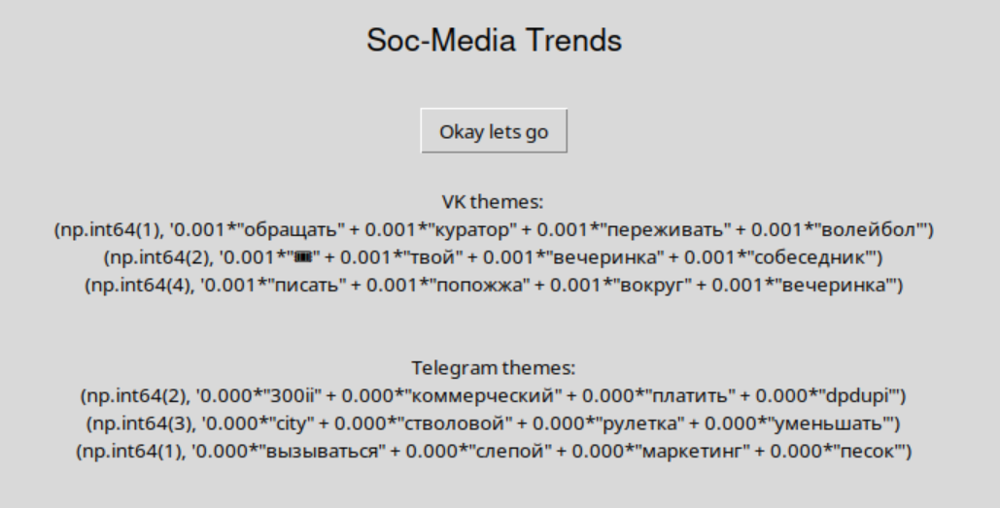

# Social Media Trends Analyze


## GUI demo




## Todo

```
- Add parameter fields for GUI
- Hide tokens before git add
```


## Get VK token & id

```bash
https://dev.vk.com/ru/mini-apps/management/creating-new-apps

# Select 'standalone-app'
# Select 'web'
# 'base domen':  localhost
# 'redirect URL: http://localhost

# token -> 'main.py' { def vk(self): api = ... }
```

## Select VK channels

```
Edit: vk.txt
```


## Get Telegram token & id

```bash
https://my.telegram.org/apps

# api_id   -> 'main.py' { def vk(self): api = ... }
# api_hash -> 'main.py' { def vk(self): api = ... }
```

## Select Telegram channels

```
Edit: tg.txt
```


## Run

```bash
./install.sh  # do it once
./run.sh

# check output/
```
