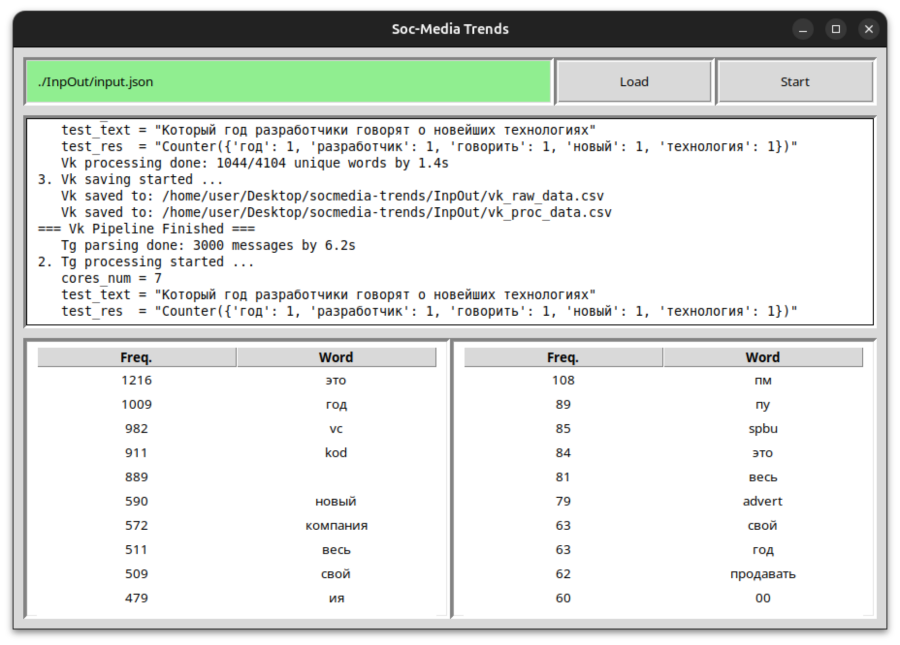

# Social Media Trend Analysis
<p>
  
</p>

## Supported OS
```
Linux
```

## Get Telegram tokens
```
https://my.telegram.org/apps
```

## Get VK tokens
```
https://dev.vk.com/ru/mini-apps/management/creating-new-apps

Select:       standalone-app
Select:       web
Base domen:   localhost
Redirect URL: http://localhost
```

## Set tokens and parameters
Edit `./InpOut/input.json`

## Run

```bash
./script/install.sh  # Do it once
./script/run.sh
```
Check `./InpOut/*.csv`
